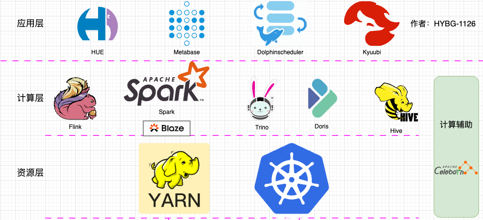
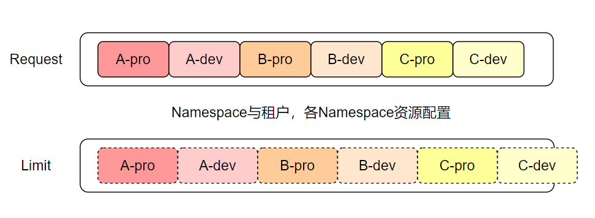
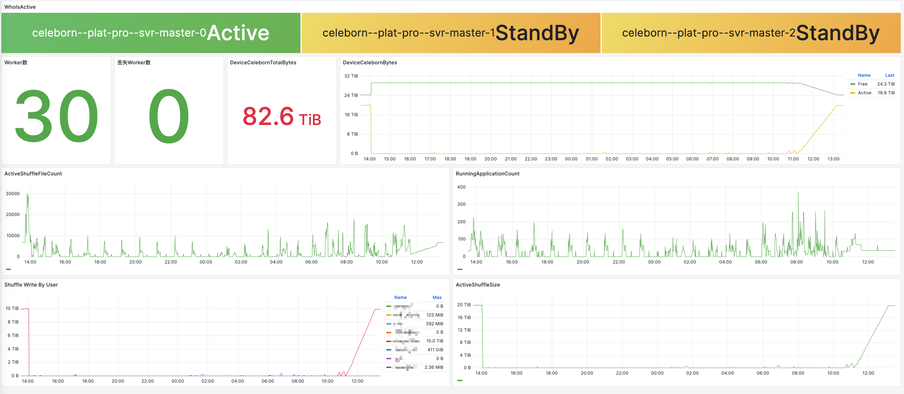
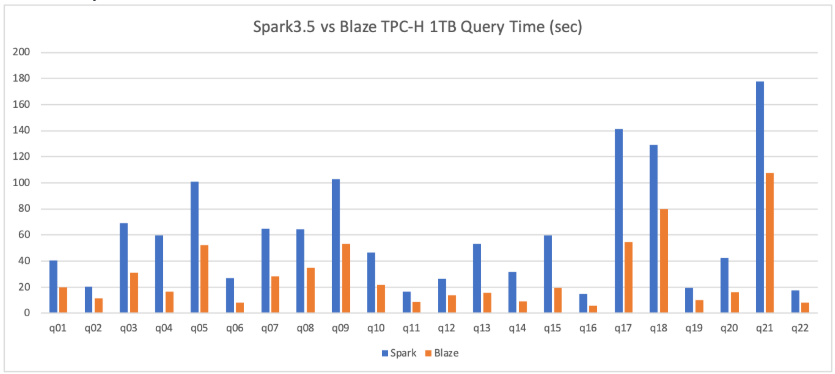
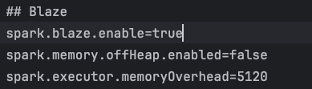
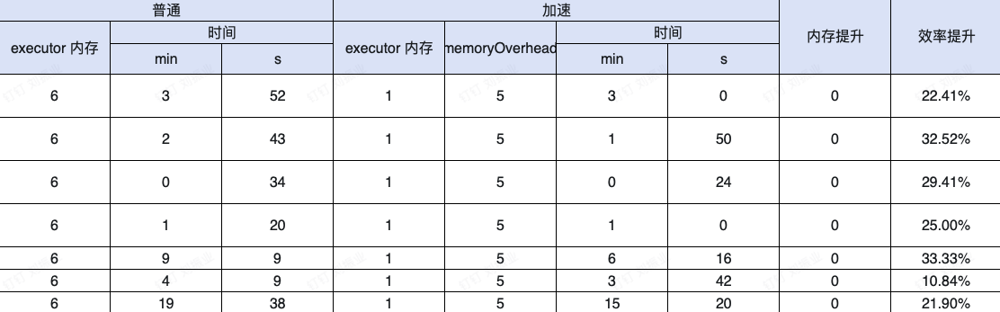
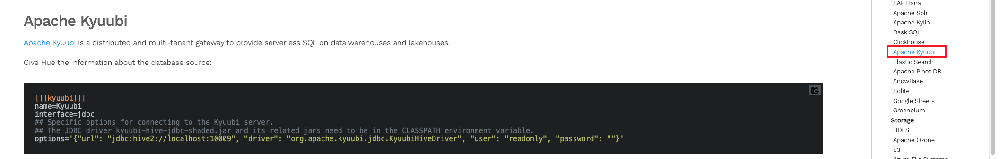
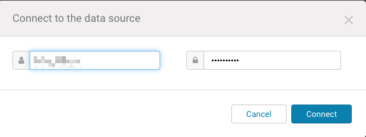

# 竞技世界大数据离线数仓从存算一体到存算分离

## 作者：HYBG-1126

	在大数据技术日新月异的当下，数据处理架构的每一次变革都为企业发展带来新的契机。竞技世界作为深耕大数据领域的企业，其从存算一体迈向存算分离的架构转变，堪称一次极具前瞻性与战略意义的探索。

## **背景与需求：**  

	在早期大数据处理阶段，存算一体架构凭借其数据存储与计算在同一设备或系统内完成的特性，具备一定的优势。这种架构减少了数据传输的复杂性，在数据量相对较小、业务场景较为单一的情况下，能够快速实现数据处理任务。例如，在一些简单的数据分析场景中，数据无需在不同设备间频繁移动，直接在本地完成计算，降低了数据传输延迟，提高了处理效率。
	
	然而，随着竞技世界业务的迅猛发展，数据量呈爆发式增长，存算一体架构的弊端逐渐显露。一方面，存储资源与计算资源紧密耦合，导致资源调配缺乏灵活性。当计算任务繁重时，存储设备的性能瓶颈可能会限制计算效率；反之，若存储需求大增，计算资源又可能出现闲置。另一方面，随着数据量的不断攀升，存算一体架构在扩展性方面面临严峻挑战。为了满足日益增长的数据存储和计算需求，企业不得不频繁地对整个系统进行升级，这不仅成本高昂，而且实施过程复杂，容易影响业务的连续性。

## 痛点与思考：

* **痛点1：** Hadoop某节点出现异常时，需要停机维护，无论是计算资源和存储资源均会受到影响

	思考：是否可以节点存储异常时不影响计算，计算异常时不影响存储

* **痛点2：** Yarn白天的资源相对较为宽松，而Impala等即席查询服务夜间资源相对宽松，造成严重的资源浪费

	思考：是否可以凌晨的调度任务与白天的即席查询任务共用一份资源，利用时间差实现资源利用率的提升

* **痛点3**：Hive稳定性好，但是效率低，晚间前置调度任务运行时长过长，最后的任务运行截止时间与上班时间齐平，一旦任务失败没有时间修复

	思考：是否可以提升调度任务的运行效率，将所有调度任务提前，为任务异常保留重试时间

## 调研与方案：

1. 谷歌通过内部服务Borg实现全球机房部署，实现存算分离架构，解决了计算存储耦合的问题，其开源版本Kubernetes具备同样存算分离的能力
2. Kubernetes在弹性方面具备优秀的设计，无论是从资源限制还是从任务运行，只要服务实现Kubernetes的接口，即可实现任务的弹性能力
3. Spark SQL 是构建在 Spark 引擎之上的。Spark SQL 利用了 Spark 的内存计算和 DAG（有向无环图）执行引擎的优势。同样的查询语句在 Spark SQL 中会被构建成一个 DAG，各个操作（如过滤、聚合等）作为 DAG 中的节点，数据可以在内存中高效地进行转换和计算，减少了磁盘 I/O 开销，在很多场景下性能优于 Hive SQL。

## **技术与组件：Kubernetes、Kyuubi、Hivemetastore、Spark、Celeborn、Blaze、Hue、Juicefs**

​

## 实践详述：

### **Kubernetes（k8s）：k8s提供存算分离计算基础**

* **结论先行：k8s为存算分离计算提供基础能力。**
* 从Hadoop入手大数据同学都知道Yarn一直在大数据计算资源中有着统治地位，Hdfs与Yarn的结合是大数据生态的基石。Yarn 在大数据批处理领域取得了显著的成功，许多基于 Hadoop 的数据处理框架，如 MapReduce、Spark、Hive 等，都能够很好地集成到 Yarn 平台上，实现资源的共享和高效利用。但是，随着云计算技术的发展和容器化技术的兴起，Yarn 的一些局限性逐渐显现出来。例如，Yarn 对资源的管理粒度相对较粗，主要以容器（Container）为单位进行资源分配，难以满足对细粒度资源（如 GPU、特定内存区域等）的精确控制需求；在支持新兴的应用场景，如微服务架构、无服务器计算（Serverless）等方面显得力不从心；此外，Yarn 的部署和管理相对复杂，对运维人员的技术要求较高。基于以上因素，随着容器化流行，资源编排工具**Kubernetes**开始在大数据领域广泛应用 **。**
* **Kubernetes优点：**

  * **强大的资源调度能力**：Kubernetes 提供了多种灵活的调度策略和算法，能够根据应用程序的资源需求（如 CPU、内存、GPU 等）、亲和性和反亲和性规则、负载情况等因素，将 Pod 智能地调度到最合适的集群节点上，实现资源的高效利用和优化分配。
  * **自动化的运维管理**：通过一系列的自动化机制，如自动扩缩容（Horizontal Pod Autoscaling）、自愈（Self-Healing）、滚动更新（Rolling Update）等，Kubernetes 能够自动应对应用程序的负载变化、故障恢复和版本更新等情况，大大减轻了运维人员的工作负担，提高了系统的可靠性和可用性。
  * **丰富的生态系统和扩展性**：Kubernetes 拥有一个庞大而活跃的开源社区，围绕它发展出了众多的工具和插件，如用于监控的 Prometheus、用于日志管理的 Fluentd、用于服务网格的 Istio 等，能够与各种云平台、存储系统、网络插件等无缝集成，满足不同用户在不同场景下的多样化需求。同时，Kubernetes 的 API 设计具有良好的扩展性，用户可以方便地根据自己的需求定制和扩展其功能
* **引入Kubernetes的好处：**

  * 解决存算一体架构，强潮汐计算问题，实现离线调度与即席查询资源互补；
  * 解决CDH闭源后，各开源组件无法升级适配问题
* **Kubernetes实践：**

  * 不同的租户创建不同的Namespace：对不同的Namespace做相应的资源强限制，实现不同租户间资源隔离，避免因为资源不足导致任务批量夯住的情况发生
  * 每个租户创建生产和测试Namespace：测试Namespace绑定过保机器，实现过保机器的二次利用，用来运行开发任务；生产Namespace绑定非过保机器，保证生产任务的稳定运行
  * Namespace资源配置Request和Limit值：通过所有任务的自适应实现集群资源部分超分（建议超分值不大于总资源的1.2倍）

​		

### **Kyuubi：**  https://kyuubi.apache.org/zh/

* **结论先行：从Hiveserve2(MR引擎)迁移到Kyuubi(Spark引擎)同等资源下单体大任务以及子母聚合体任务均有6倍左右效率提升，部分可达10倍**
* **官网原话：Apache Kyuubi，一个分布式多租户网关，用于在数据湖提供无服务器 SQL。**
* **引入背景：**

  * 一般来说离线数仓任务黄金运行时段是00:30-- 08:00，但是随着任务增加，在有限的计算资源下，数仓任务运行截止时间一度超过08:00，这在某种程度会影响后面其他的分析工作，要解决这个问题，要么增加资源，要么提升任务运行效率。我们选择了后者，前期也考虑了Hive On Spark模式，但是这与去CDH的愿景相左，经过调研发现Kyuubi可以完美避开CDH并且相关组件可以All On K8s，与我们的需求不谋而合。
* **实践方案：**

  * **参考：Apache Kyuubi on Spark 在CDH上的深度实践**（https://www.modb.pro/db/110942）

    * 上面是**网易有数**官方教程，教程很清晰，各个步骤简单，如果是CDH环境按照教程肯定没问题(👍🏻👍🏻👍🏻)。下面说一下on kubenetes怎么玩
  * **参考：Apache Kyuubi on CDH 在竞技世界大数据平台实践**（https://mp.weixin.qq.com/s?__biz=Mzg2MDA5MTU4OA==&mid=2247497852&idx=1&sn=8facac617e9c101c653beafdd58a79bb&scene=21#wechat_redirect）

    * 这篇文章是我的内部实践，算整个架构实践的开局，文章内容说的比较清楚了，后面就不在赘述Kyuubi的部署与安装应用了。有问题，可联系。
  * **参考：如何优化 Spark 小文件，Kyuubi 一步搞定！** （https://www.modb.pro/db/423478）

    * 这是Kyuubi PMC 王震的文章，里面详细讲了怎么使用kyuubi解决Spark 小文件的问题，强推，我实践验证，原来36Mb分为2万个小文件，使用合并后合并为1个文件。
  * **注意：**

    * 最好不要在小文件很多的HDFS上使用Kyuubi-Spark，可能因为Spark的查询过于强劲而导致HDFS的Rpc骤增，HDFS集群稳定性骤降
    * Kyuubi具备小文件合并功能，但是开启小文件合并可能降速，另外截止目前合并小文件功能，暂时不适用hive分桶表
* Kyuubi使用：

  * 在上述每个Namespace中部署一个Kyuubi服务，每个Kyuubi配置2c4g资源，每个服务3个实例，共计6c12g可实现不同租户不同业务Kyuubi服务隔离，避免任务将Kyuubi打挂影响别的业务
  * 对接小海豚替换Hive命令，跑数仓离线调度任务，实现效率翻倍，当前已经实现85%的HiveSQl任务转为SparkSQL
  * 对接Hue，提供开发SQL入口，对比HQL开发效率提升
  * 使用helm安装Kyuubi建议自定义增加优雅关闭配置，避免upgrade时任务异常（https://github.com/apache/kyuubi/pull/6892）

### **Celeborn：**  https://celeborn.apache.org/

* **结论先行**：

  * **Celeborn解决了Spark on k8s 原生无法开启dynamicAllocation的问题**
  * **对比关闭Shuffle单纯设置Spark executor实例个数，性能提升约3倍**
* **官网原话：Celebrorn是大数据计算引擎（即ETL、OLAP和流媒体引擎）的中间数据服务，旨在提高性能、稳定性和灵活性。中间数据通常包括洗牌和溢出数据**
* **引入背景：如果只是单单实现Kyuubi+Spark on k8s距离具备生产能力还差的远，因为Spark在脱离Yarn环境后无法开启外部shuffle功能，关闭Shuffle后Spark无法开启动态扩缩容**
* **实践方案：**

  * **裸金属部署：**

    * 3个虚机Master节点：Master开启HA，稳定
    * 30个物理机Worker节点：每个worker节点配置两块SSD硬盘，每块硬盘500G，总计30T空间
    * 使用裸金属部署人工操作较多，需要使用Ansible等工具批量处理Worker配置
  * **on Kubernetes部署**：**强烈推荐**

    * Master集群：3个Pod节点，开启HA，使用K8s原生能力，pod异常时自动恢复，Active自动切换
    * Worker集群：30个Pod节点，每个Pod挂载Node上两块SSD盘，每块硬盘500G，总计30T空间
    * 简单测试，用户单任务Shuffle数据可达10T，瞬时ActiveShuffleFile可达30000，满足当前需求
    * **说明：** Celeborn on Kubernetes的配置项设计如同是**程序员之光，** 配置项的设计深得我心，细节令人欢喜
    * **on Kuberntes特性：**

      * **Worker均匀分布：** 该特性由官方设计好，部署成功后，在Kuberntes每个node上只会启动一个Worker
      * **快速启动：** 经过测试该模式下Celeborn扩展集群，仅需1分钟，比如Worker个数5个提升至10个，只需要修改配置后，执行 helm upgrade命令，自动更新至10个Worker，因为内部存在计算空档，所以每次升级操作只需要在空挡内执行命令即可一键升级
      * **面向未来：**

        * **定时扩缩容：** 待应用，使用Kubernetes 插件Keda，可以在夜间提升Celeborn的实例个数，提升性能，闲时降低Celeborn个数，将资源分配给其他开发任务
        * **自动扩缩容：** 希望官方可以快点出。当然了也可以通过其他方式实现，因为没有实践，先不赘述
  * **监控**

    * ​
* **Celeborn使用：**

  * 配置参考：

    * ```yaml
      #不使用Blaze使用该配置
      spark.shuffle.manager=org.apache.spark.shuffle.celeborn.SparkShuffleManager
      # 使用Blaze时使用该配置
      spark.shuffle.manager=org.apache.spark.sql.execution.blaze.shuffle.celeborn.BlazeCelebornShuffleManager
      spark.serializer=org.apache.spark.serializer.KryoSerializer
      spark.celeborn.master.endpoints=xxxxx:9097
      spark.shuffle.service.enabled=false
      spark.celeborn.client.spark.shuffle.writer=hash
      spark.celeborn.client.push.replicate.enabled=false
      spark.sql.adaptive.localShuffleReader.enabled=false
      spark.sql.adaptive.skewJoin.enabled=true
      spark.shuffle.sort.io.plugin.class=org.apache.spark.shuffle.celeborn.CelebornShuffleDataIO
      spark.dynamicAllocation.shuffleTracking.enabled=false
      spark.celeborn.quota.identity.provider=org.apache.celeborn.common.identity.HadoopBasedIdentityProvider
      ```
  * 注意：

    * 在验证过程中，使用Spark<3.5.0的版本出现过**dynamicAllocation**功能时好时坏的情况，建议Spark版本>=3.5.0，同时也避免打补丁
    * 截止目前最新版本为0.5.3版本，建议使用最新版本，Client和Server均使用最新，0.5.1上已知bug在0.5.3上得到了修复
  * 参考：Apache Celeborn 在B站的生产实践（ https://mp.weixin.qq.com/s/8TkPl5GMCxONzxipzlvu9g）

### **Blaze：** https://blaze-project.github.io/

* **结论先行：在同等CPU，内存资源下，SparkSQL性能提升20%-30%**

  * **这是官方验证的效率提升，可以看到有很多任务效率提升在100%左右，相信随着优化升级，我们也能达到更好的落地效果**
  * ​
* **官网原话：Blaze是Apache Spark的加速器，它利用本机矢量化执行来加速SQL/DataFrame查询**
* **引入背景：使用SparkSQl替换HIveSQl中不断有新增任务进来，Spark性能再次提升，成为是目前这个存算分离架构的最后一块拼图，经过验证Blaze性能不错**
* **实践方案：**

  * Blaze是目前所有引用的组件中最简单的一个，第一步复制Jar包至SPAKR_HOME/jars下，第二步添加三条配置
  * 配置：

    * ​
    * 因为前面用到Celeborn，所以这里Blaze要选用 **&gt;=4.0.1**版本
    * 实际的配置参考：https://github.com/kwai/blaze，我这里只有这三条配置的原因是，前面Celeborn的部分配置已经上了
* **效果验证：**

  * 我的策略是将原来executor的6g内存分为executor + memoryoverhead =1g  + 5g，尽可能的将资源给Blaze用来加速，每一行代表一个生产sql在同一种配置下的验证结果，**在同等资源下，平均有25.06%的性能提升。**
  * 下图中加速代表使用Blaze插件，普通代表没有使用Blaze插件

    ​

### **Hue：** https://gethue.com

* **结论先行：** 想要有一个顺手的SQL编辑查询页面，想必是所有大数据开发的基础需求，但是作为大数据工程师，前端的薄弱如影随形，在比较了几款SQL编辑查询工具后，最后还是选择HUE。
* **官网原话：Hue是一个用于数据库和数据仓库的开源SQL助手**
* **引入背景：**

  * CDH中提供Hue服务，使用多年，用户习惯已经形成
  * Hue支持Docker部署
  * Hue支持的连接器众多，满足需求
* **实践方案：**

  * On Kubernetes部署：

    * 首先要先了解一下HUE的配置方式，把hue.ini配置好，如果不太熟悉，可以先网上搜索一下。把配置放置在hue的特定目录：`/usr/share/hue/desktop/conf`​下
    * 下面是yaml文件供参考：

      * ```yaml
        apiVersion: apps/v1
        kind: Deployment
        metadata:
          name: hue
          labels:
            app: hue-server
        spec:
          replicas: 1
          selector:
            matchLabels:
              app: hue-server
          template:
            metadata:
              labels:
                app: hue-server
            spec:
              serviceAccountName: hue
              imagePullSecrets:
                - name: image-pull
              containers:
                - name: hue-server
                  # TODO: replace this with the stable tag
                  image: gethue/hue:20241031-140101
                  imagePullPolicy: Always
                  command: ["/bin/sh"]
                  args: ["-c","XXXXXXXXXXX;/usr/share/hue/startup.sh"]
                  resources:
                    requests:
                      cpu: 2
                      memory: 4Gi
                    limits:
                      cpu: 2
                      memory: 4Gi
                  ports:
                    - name: frontend-port
                      containerPort: 8888
                      protocol: TCP
                  volumeMounts:
                    - name: hue-pvc
                      mountPath: /opt/XXX
              volumes:
                - name: hue-pvc
                  persistentVolumeClaim:
                    claimName: hue-pvc
        ```
      * 其中Hue的pod个数建议1个，避免路由错误
  * Kyuubi in Hue:

    * 参考：开源版 Hue 接入 Kyuubi，统一 SQL 入口，提升开发效率，解耦 Hue 和 CDH（https://mp.weixin.qq.com/s/XpPDIpVDjgVwv8qG6olmBA）
    * 上面参考是过时的玩法，但是具有参考意义，2024年3月开始Kyuubi在Hue的源码中出现，后续在Hue官网上可以看到以下内容：

      * ​
      * 这意味着Hue开始原生支持Kyuubi，目前我在使用的也是这种方式：
      * ​
      * 必要条件：

        * Kyuubi要开启Ldap认证
        * 如果不想固定死Hue中Kyuubi的登录用户，Kyuubi开启Ldap认证，在Hue中会出现以下认证框，认证后即可进入Kyuubi开发：

          * ​
      * 缺点：

        * 认证频繁：认证弹窗在刷新页面后会弹出
        * SASL异常：第一次查询时，偶发SASL异常，重跑SQL即可，与开启Kerberos有关；
      * 注意事项：

        * Kyuubi开启Ldap后配置，不要配置后面的user，password
        * ```yaml
          [[[kyuubi]]]
               name=Kyuubi
               interface=jdbc
               options='{"url": "jdbc:hive2://kyuubi-ip:10009", "driver": "org.apache.kyuubi.jdbc.KyuubiHiveDriver"}'
          ```

## 总结：

* 通过对K8s技术的引进，以及从存算一体架构向存算分离架构的尝试与验证，探索出了适合内部的存算分离之路，为解决传统大数据资源粗放管理以及提升资源利用率提供了可能性
* 我认为Kyuubi+Spark是替代Hive+MR的绝佳方案，Kyuubi本身质量优秀，开箱即用，社区友好，非常适合作为一个长期跟踪升级的项目
* Celeborn 是我实现Spark On K8s 弹性计算的关键，同时也我用起来最顺畅的On K8s组件，部署简单，配置项细节丰富，社区友好
* Blaze是最有性价比的组件，配置简单，效果明显，是小而美的典范，社区友好
* Hue老当益壮的SQL编辑查询软件，目前没有找到其他优秀的可替代品，期望Hue后面可以焕发青春对流行组件多做深度支持

## 感谢：

Kyuubi：Cheng Pan，王震

Celeborn：子懿，明济，一锤，履霜

Blaze：王磊

感谢以上这些大佬的帮助，我才能把此架构搭建起来，感谢。

## 联系方式

* Kyuubi(微信)

  * ​
* Celeborn(钉钉)：

  * ​
* Blaze(微信)：

  * ​
* 本人(微信)：

  * ​
